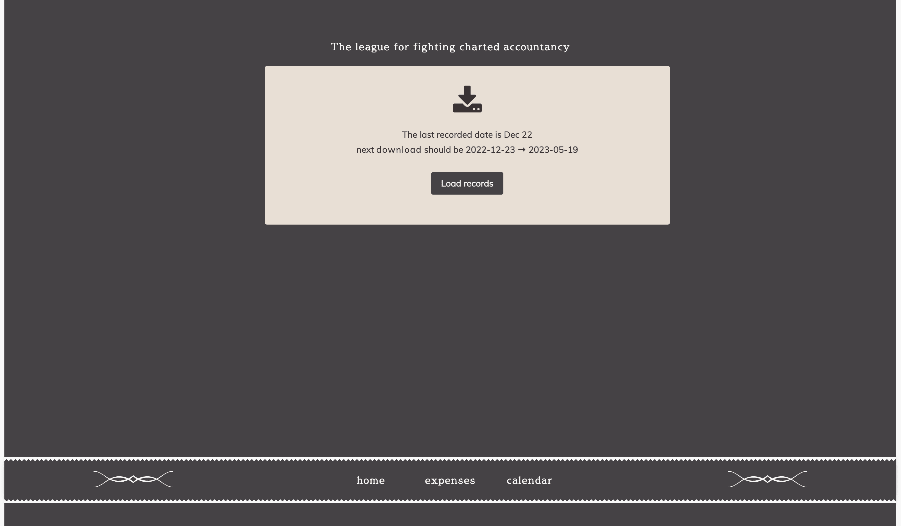
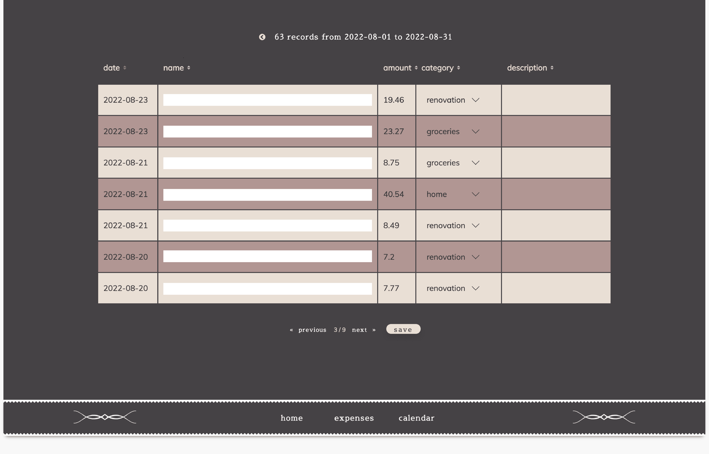
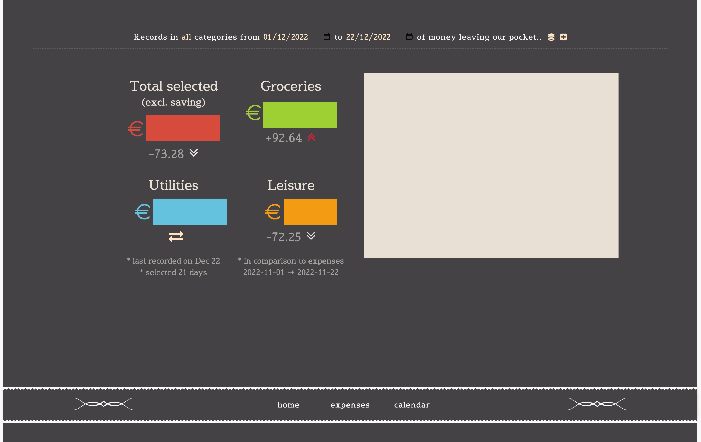

# household helper
A silly app to help us monitor our spendings.

upload expenses .csv records (downloadable from mijn.ing)

edit & assign categories. The paginator and saving are not exactly pleasant.. back in the days I have not discovered the wonder of vue and vuex.

then show the stats! and possibly some graph, no time to work on it yet. 

## My expense categories

-   groceries (AH, jumbo, etos)
-   house
-   home (non consumer, movable)
-   renovation
-   car
-   tools (praxis)
-   utilities
-   presents
-   leisure
-   clothing
-   travel
-   commute
-   hobbies
-   misc
-   savings
-   furball

admin - warmehuisje
